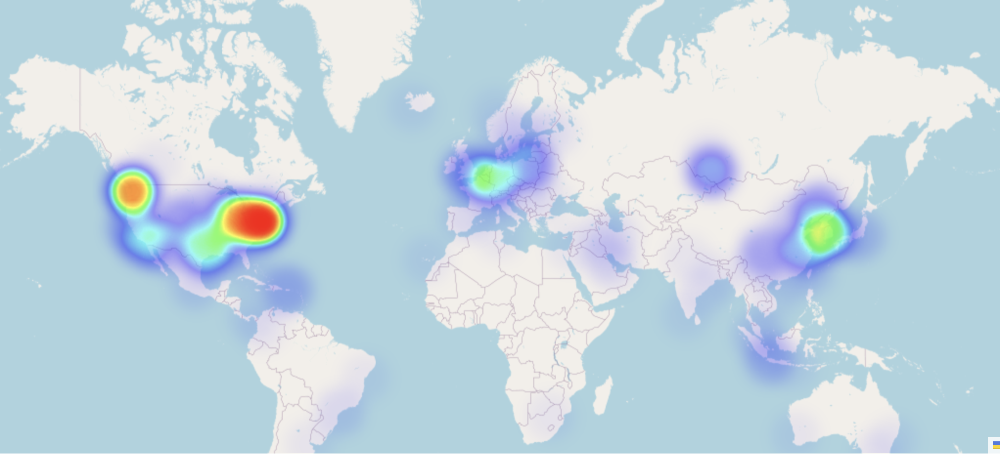
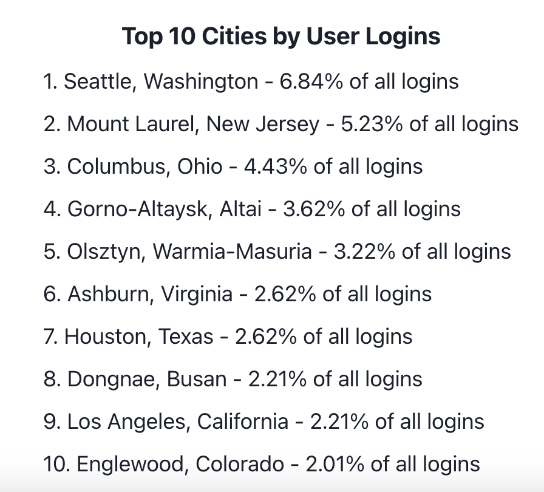
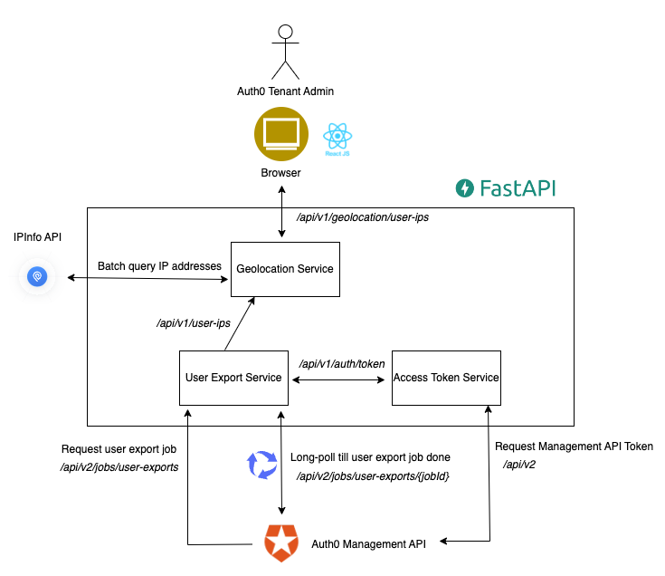
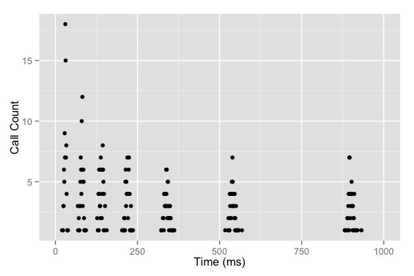

# AuthGlobeTrek

This project provides an interactive heatmap visualization of user IPs around the world to help Auth0 tenant administrators better understand their consumers

## Table of Contents


- [Features](#features)
- [Setup](#setup)
  - [Prerequisites](#prerequisites)
  - [Local Setup](#local-setup)
  - [Docker Setup](#docker-setup)
- [Technical Considerations](#technical-considerations)
- [Acknowledgments](#acknowledgments)

## Features

- Interactive heatmap visualisation of user activity around the world based on their login IPs. Fully interactive with zoom in/out functionality

<p align="center">
    
</p>
- Search queries to filter down user distribution based on Auth0 `user_metadata` values (e.g. `subscription_tier: free`, or `purchasing_behaviors: frequent buyer`). The filters help you understand geographical distribution of users based on their profiles so businesses can understand and target regional customer needs

<p align="center">
    
</p>

- City + Region Aggregate Statistics. AuthGlobeTrek summarises your top 10 most popular regions for your users

<p align="center">
    
</p>

## Setup

### Prerequisites

1. Install [npm and Node.js](https://docs.npmjs.com/downloading-and-installing-node-js-and-npm) and [pip](https://pip.pypa.io/en/stable/installation/).
2. Set up an Auth0 account and an M2M application with authorization to access the Management API. Refer to [Auth0's documentation](https://auth0.com/docs) for more details.
3. Retrieve your own API Access Token from [IPInfo.io](https://ipinfo.io/).
4. Fill out the `.env.example` file in the `/backend` directory and rename it to `.env`.

### Local Setup

1. Install frontend dependencies:

```bash
cd frontend
npm install
```
2. Install backend dependencies:

```bash
cd backend
pip install -r requirements.txt
```

3. Start backend server:

```bash
cd backend
python -m uvicorn main:app --reload
```


4. Start frontend service:

```bash
cd frontend
npm start
```
5. Once everything is running, you can access the system at `localhost:3000`.


### Docker Setup (Fix In-Progress)

You can also set up the project using Docker:

```bash
docker-compose up
```

Please note that the Docker setup is a bit buggy and I'm currently working on a fix. The system can still be accessed at `localhost:3000`.

## Technical Components and Considerations



- Server is written in Python FastAPI and frontend in React

- The server utilises Auth0's Management API to get access tokens and request for user export jobs, thereby allowing the tenant admin to exceed 1000 user limit via normal API calls to `/api/v2/users` endpoints if they so desire

- The server uses batch operations to query IP address information to [IPInfo.io](https://ipinfo.io/)

### Some Challenges

#### Long polling for user export and avoiding Rate Limit issues

- Using Auth0 Management API to create a user export job happens asynchronously, so the server needs to long poll to Auth0 Management API endpoint `/api/v2/jobs/user-exports/{jobId}` to check when the export job is finished

- Constantly checking at linear times may result in heavy load on the server and running into rate limit issues

- Strategy: Use [Exponential Backoff with jitter](https://www.baeldung.com/resilience4j-backoff-jitter). Exponential backoff with jitter for long polling helps to reduce the load on the server and avoid hitting rate limits by progressively increasing the wait time between consecutive polling attempts. The addition of jitter, or random variation, prevents synchronized requests from multiple clients, which could otherwise overwhelm the server when they all retry at the same time.

<p align="center">
    
</p>

#### Slowness in IP address querying and user export job

- Using IPInfo API to query IP addresses one at a time was too slow and often hitting HTTP request timeouts

- Strategy 1: Use caching to remember already-queried IP addresses

- Strategy 2: Use IPInfo's [batch processing methods](https://github.com/ipinfo/python#batch-operations) for faster processing of bigger batches

- Strategy 3: Async and concurrent processing using Python's [asyncio library](https://github.com/nicholas-gcc/auth-globe-trek/blob/main/backend/services/ipinfo_service.py#L32)

- Improvements in performance have been notable. First queries are still on the slower end and I will be looking for ways to improve the bottleneck, but subsequent queries are many magnitudes faster

**Performance with 200 users for first three requests**


**Performance with 500 users for first two requests**


#### Test data considerations

- This iteration only uses `last_login_ips` coming from the `user_metadata` field, which is set by the Applications or APIs themselves. By default, `last_login_ips` are not found in `user_metadata` but instead in `app_metadata`

- Test users were created using the script in `/backend/utils/make_users.py` and imported using Auth0's [User Import/Export Extension](https://auth0.com/docs/customize/extensions/user-import-export-extension). By default, importing users do not allow you to set certain fields in `app_metadata` like `last_login_ips`. Since I don't have my own user base, I decided to set the `last_login_ips` myself on `user_metadata`

## Acknowledgements

Thanks to my colleagues at Okta/Auth0 for giving me all the resources and help to learn and organising the Gotta Hack 'Em All hackathon event which gave me the chance to work on such an interesting project!
